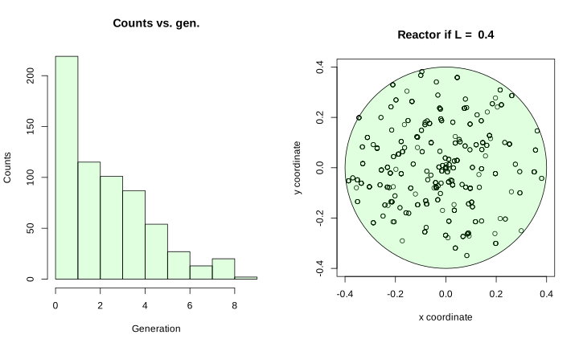
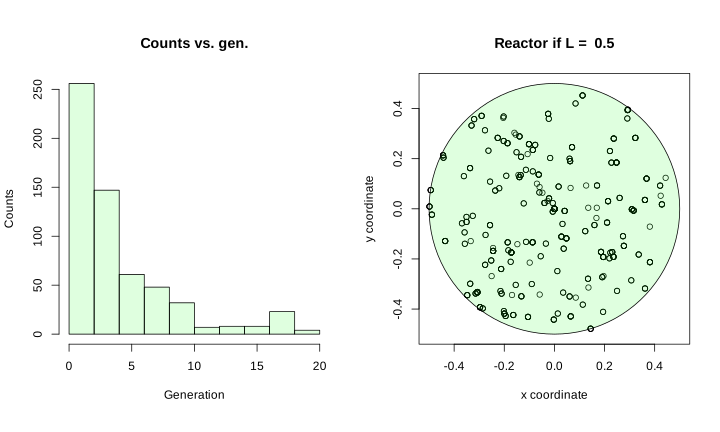
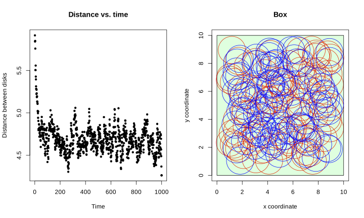
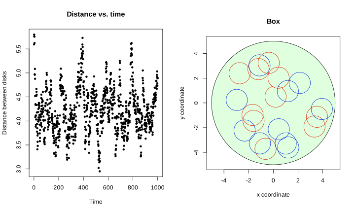

# **MonteCarlo exercise** - Cayetano Soneira

Choose one of the following examples and code it in R. Upload the code accompanied by a brief report
(no more than 4 pages) with a description of the method and some results.
1. Simplified nuclear reactor.
2. Metropolis for hard spheres.

## **Simplified nuclear reactor.**

### **The question**

### *Simulate a simple version of a nuclear reactor in which the mean free path is constant (for example = 1). The mean number of neutrons in each fission is also fixed (for example to 3). Study as a function of the size of the container if the process grows exponentially or stays under control. Assume exponential law for the distance before an interaction and Poisson law for the number of neutrons.*

**Nuclear fission** as a Montecarlo simulation.
1. **Physical model:** A neutron is produced with a given E and direction.
2. **Propagation I:** Interaction given an average path length, $\lambda(E)$, that happens at $l\approx e^{-\frac{x}{\lambda}}$.
3. **Propagation II:** Check if the interaction is inside the reactor: if yes, simulate the reaction; else (no), we are done with that neutron: we consider it has been lost.
4. **Interaction**: for those neutrons that interact inside the reacotr, we simulate the fission:
    - Number of neutrons generated: as a poisson process. If the number of generated neutrons is 0, we consider it thermally absorbed.
    - Energy of neutrons: in tbis case it is not relevant.
    - Direction of neutrons: we generate a random angle for the movement.
    - **Go back to step 2**

### **The solution**


```R
library("plotrix")

# 1.1 We set the different sizes of the container that we are testing,
# in this case a circular reactor with radius L
Ls <- c(0.4,0.5,0.6)
# 1.2. The mean free path
long <- 1
# 1.3. The mean of the poisson
lambda <- 3
# 1.4 The number of iterations
Niter <- 10000

for (L in Ls){
        # 1. We get some initial neutrons with some position and momentum
        # (x,y,px,py)
        
        table <- rbind(c(0,0,-0.5,0.5,0))
        
        for (i in 1:100){
            table <- rbind(table,c(0,0,runif(1,-1,1),runif(1,-1,1),0))
            }
    
        # 2. We start the chain reaction
        total_neutrons <- c()
        lost_neutrons <- 0
        thermally_absorbed <- 0
    
        for (i in 1:Niter){
            
            if ( i > length(table[,1]) ){
                #cat("Reaction dissipated at ",i, " iterations\n")
                break
                }

            x <- table[i,1]
            y <- table[i,2]
            px <- table[i,3]
            py <- table[i,4]
            p <- sqrt(px**2 + py**2)
            gen <- table[i,5]

            # 3. We get the position of the interaction:
            alpha <- atan2(py,px)
            l <- rexp(1, rate=1/long)
            newx <- x + l*cos(alpha)
            newy <- y + l*sin(alpha)

            # 4. We see if this neutron is inside of the reactor:
            if (sqrt(newx**2 + newy**2) > L){
                lost_neutrons <- lost_neutrons + 1
                next
                }

            # 5. Once we know it is inside, we calculate the number of
            # neutrons generated in the fission:
            neutrons <- rpois(1, lambda)

            if (neutrons == 0){
                thermally_absorbed <- thermally_absorbed + 1
                next
                }

            for (j in 1:neutrons){
                beta <- runif(1,0,2*pi)
                table <- rbind(table,
                               c(newx,newy,p*cos(beta),p*sin(beta),gen + 1))
                }
        }
    
        options(repr.plot.width=10,repr.plot.height=6)
        par(mfrow=c(1,2))

        hist(table[,5][-length(table[,1])],main = paste("Counts vs. gen."),
             xlab = paste("Generation"), ylab = "Counts",
            col =rgb(0,1,0,1/8))

        par(pty="s")
        plot(table[,1],table[,2],xlim = c(-L, L),ylim = c(-L, L),
             xlab = paste("x coordinate"), ylab = "y coordinate",pch=1)
        title(main = paste("Reactor if L = ", L))
        draw.circle(0, 0, L,col =rgb(0,1,0,1/8))

        cat("Total neutrons",length(table[,1]),"\n")
        cat("Lost neutrons:",lost_neutrons,"\n")
        cat("Thermally absorbed neutrons:",thermally_absorbed,"\n")           
}
```

    Total neutrons 639 
    Lost neutrons: 459 
    Thermally absorbed neutrons: 9 


    

    


    Total neutrons 595 
    Lost neutrons: 420 
    Thermally absorbed neutrons: 12 


    

    


    Total neutrons 11356 
    Lost neutrons: 6239 
    Thermally absorbed neutrons: 184 


    

    


### **Conclusion**

We see that the critical diameter for the reactor is around the mean path, $l\approx 1$. For the case with a reactor diameter of $d=0.8$, when the reaction is started with hundreds of neutrons, these and the neutrons generated by them finally escape after some generations. When $d=1.2$, the reaction explodes, adding exponentially new neutrons. We could say, then:
- For $L<0.5$, the reaction is subcritical.
- For $L>0.5$, the reaction is supercritical.

The ideal working radius should be around $L\approx0.5$, but our simulations show, due to the inherent randomness of the process, that a smooth, constant-neutron-number performance is not possible to achieve within a reactor of such characteristics. **This suggests the idea of adding an extra limiting apparatus to avoid the exponential growth of the neutron inside the container**.

## **Metropolis for hard spheres**

### **The question**

### *Use the Metropolis algorithm to get random numbers for pairs of non-overlapping spheres or disks of radius R in a square box of side L, uniformly distributed. Study the convergence of quantities such that the distance between spheres, or the closest distance of any sphere to a wall. Check for the cases of 2 or three disks. Compare the cases when L is large compared to R with the case when the spheres just fit into the box.*

We are going to use the Metropolis algorithm to model the movement of some disks in a box of side $L$. This algorithm has some steps that, for our case, can be summarized as:
1. **Generate a sample of random walkers:** we create two disks, each one in some corner of the square box to make sure thay are not overlapping.
2. **Calculate the random walk:** we calculate a different displacement for each disk.
3. **Evaluate q, the probability of the displacement:** we consider q=1 if the new position for the disks keeps them inside the box, a the distance to the wall given by the radius of each disk and they are not overlapping.
4. **Accept/reject the new position with prob q:** once we have q determined we accept the displacement if q=1 and discard it if q=0.
    - **Back to step 2**

We are going to calculate $N_{iter}$ iterations of the Metropolis algorithm for $N$ cases simoultaneously in ordar to have statistics.

### **The solution**

#### *For a square box*


```R
metroBox <- function(a,N,Niter,L,R){
    
    mea <- c()
    
    # 1. Generate a sample of random walkers
    
    r <- cbind(runif(N,R,(L-R)/2),runif(N,R,(L-R)/2),runif(N,(L-R)/2,(L-R)),runif(N,(L-R)/2,L-R))
    
    for (i in 1:Niter){
        # 2. Calculate the random walk
        delta <- cbind(runif(N,-a,a),runif(N,-a,a),runif(N,-a,a),runif(N,-a,a))
        
        # 3 & 4. Evaluate q and accept/reject rn with prob q
        q <- rep(1,N)
        t <- runif(N,0,1)
        
        rini <- r
        r <- r + delta
        
        # Distance between disks
        q <- ifelse( sqrt( (r[,1]-r[,3])**2 + (r[,2]-r[,4]) **2) < 2*rep(R,N), rep(0,N), q)
        
        # Distance between x of disk 1 and walls
        q <- ifelse( r[,1] < R, rep(0,N), q)
        q <- ifelse( r[,1] > L-R, rep(0,N), q)
        
        # Distance between y of disk 1 and walls
        q <- ifelse( r[,2] < R, rep(0,N), q)
        q <- ifelse( r[,2] > L-R, rep(0,N), q)
        
        # Distance between x of disk 2 and walls
        q <- ifelse( r[,3] < R, rep(0,N), q)
        q <- ifelse( r[,3] > L-R, rep(0,N), q)
        
        # Distance between y of disk 2 and walls
        q <- ifelse( r[,4] < R, rep(0,N), q)
        q <- ifelse( r[,4] > L-R, rep(0,N), q)
        
        r <- ifelse(cbind(t,t,t,t)<cbind(q,q,q,q),r,rini)
        
        mea <- c(mea, mean(sqrt( (r[,1]-r[,3])**2 + (r[,2]-r[,4]) **2)))
        
        # 5. Back to step 2
        }
    
    options(repr.plot.width=10,repr.plot.height=6)
    par(mfrow=c(1,2))
    
    plot(mea,pch=20,main = paste("Distance vs. time"),
             xlab = paste("Time"), ylab = "Distance between disks")
    
    plot(r[,1],r[,2],col="red",xlim = c(0, L),ylim = c(0, L),pch=1,
         main = paste("Box"),
         xlab = paste("x coordinate"), ylab = "y coordinate",cex = 10)
    rect(0, 0, L, L,col =rgb(0,1,0,1/8))
    points(r[,3],r[,4],col= "blue",pch=1,cex = 10)
    
    cat("Mean of the mean distance: ",mean(mea),"\n")
    cat("Standard deviation of the mean distance: ",sd(mea))
}
```


```R
metroBox(1,100,1000,10,1)
```

    Mean of the mean distance:  4.690746 
    Standard deviation of the mean distance:  0.1720876


    

    


#### *For a circular box*


```R
metroCircle <- function(a,N,Niter,L,R){
    
    mea <- c()
    
    # 1. Generate a sample of random walkers
    
    r <- cbind(runif(N,-L/1.5,0),runif(N,-L/1.5,0),runif(N,0,L/1.5),runif(N,0,L/1.5))
    
    for (i in 1:Niter){
        # 2. Calculate the random walk
        delta <- cbind(runif(N,-a,a),runif(N,-a,a),runif(N,-a,a),runif(N,-a,a))
        
        # 3 & 4. Evaluate q and accept/reject rn with prob q
        q <- rep(1,N)
        t <- runif(N,0,1)
        
        rini <- r
        r <- r + delta
        
        # Distance between disks
        q <- ifelse( sqrt( (r[,1]-r[,3])**2 + (r[,2]-r[,4]) **2) < 2*rep(R,N), rep(0,N), q)
        
        # Distance between disk 1 and walls
        q <- ifelse( sqrt( (r[,1])**2 + (r[,2]) **2) > rep(L-R,N), rep(0,N), q)
        
        # Distance between disk 2 and walls
        q <- ifelse( sqrt( (r[,3])**2 + (r[,4]) **2) > rep(L-R,N), rep(0,N), q)
        
        r <- ifelse(cbind(t,t,t,t)<cbind(q,q,q,q),r,rini)
        
        mea <- c(mea, mean(sqrt( (r[,1]-r[,3])**2 + (r[,2]-r[,4]) **2)))
        
        # 5. Back to step 2
        }
    
    options(repr.plot.width=10,repr.plot.height=6)
    par(mfrow=c(1,2))
    
    plot(mea,pch=20,main = paste("Distance vs. time"),
             xlab = paste("Time"), ylab = "Distance between disks")
    
    par(pty="s")
    plot(r[,1],r[,2],col="red",xlim = c(-L, L),ylim = c(-L, L),pch=1,
         main = paste("Box"),
         xlab = paste("x coordinate"), ylab = "y coordinate",cex = 8)
    points(r[,3],r[,4],col= "blue",pch=1,cex = 8)
    draw.circle(0, 0, L,col =rgb(0,1,0,1/8))
    
    cat("Mean of the mean distance: ",mean(mea),"\n")
    cat("Standard deviation of the mean distance: ",sd(mea))
}
```


```R
metroCircle(1,10,1000,5,1)
```

    Mean of the mean distance:  4.222609 
    Standard deviation of the mean distance:  0.4689121


    

    


### **Conclusion**

**Square box.** Thus, we get, for 1000 disks and 1000 iterations:
- Mean of the mean distance:  4.73
- Standard deviation of the mean distance:  0.13

**Circular box.** We obtain, for 1000 disks and 1000 iterations:
- Mean of the mean distance:  4.15
- Standard deviation of the mean distance:  0.22


```R

```
